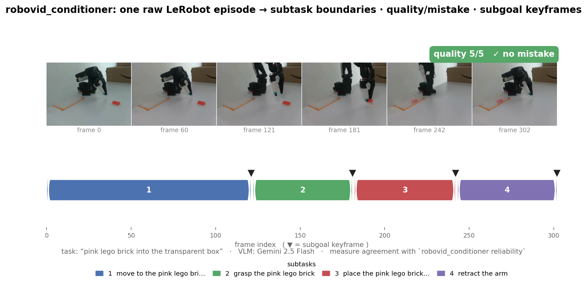
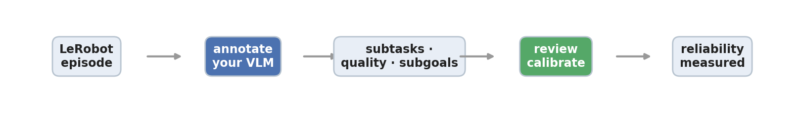

# robolabel

**robolabel is a LeRobot-first open-source tool that uses VLMs to draft temporally grounded subtask and episode-quality annotations, then measures those drafts against human calibration instead of treating auto-labels as ground truth.**

It drafts three things per episode — **subtask temporal boundaries**, **episode quality/strategy metadata**, and **subgoal keyframes** — and then tells you how far those drafts are from a human, in the same units. The honest claim here is not "good labels." It is **labels + measurement + a fixing loop**.

The annotation recipe (subtask decomposition + quality + subgoals as conditioning for a downstream policy) is motivated by the π-series VLA work — [π0](https://www.pi.website/download/pi0.pdf) and [π0.5](https://arxiv.org/abs/2504.16054) — but robolabel implements *measurable annotations for LeRobot data*, not those papers' model or training schema.



*One real SO-101 episode, labeled by Gemini 2.5 Flash: the filmstrip is the raw video; the numbered bar is the subtask segmentation; ▼ marks each subgoal keyframe; the chip is the quality/mistake judgment. That is everything the tool adds — and then it measures how much a human disagrees with it.*



---

## 60-second quickstart

Install and run the offline demo (no API key, finishes in seconds):

```bash
pip install -e .          # or: uv pip install -e .
robolabel demo --out demo_out
```

That generates tiny synthetic episodes, annotates them with the (meaningless)
mock provider, and writes a valid `annotations.parquet` — proving the pipeline
end to end without spending a cent.

Now do it for real on a LeRobot dataset with a real VLM:

```bash
pip install -e '.[lerobot]'
export GEMINI_API_KEY=...          # the error names the exact var if you forget

robolabel annotate \
  --source lerobot \
  --target lerobot/svla_so101_pickplace \
  --provider gemini --strategy S2 --limit 5 \
  --out so101_annotations

robolabel gate        --annotations so101_annotations          # automatic red flags
robolabel review      --annotations so101_annotations --gold so101_gold.json \
                 --source lerobot --target lerobot/svla_so101_pickplace
robolabel reliability --gold so101_gold.json                    # VLM-vs-you agreement
robolabel export      --annotations so101_annotations --format lerobot --out so101_lerobot
```

Providers: `gemini`, `openai`, local `qwen` (`pip install '.[qwen]'`), and `mock`.
Adding another is one new file in the providers package. Full real walkthrough:
[`docs/lerobot_walkthrough.md`](docs/lerobot_walkthrough.md). Output schema and the
LeRobot subtask-convention export: [`SCHEMA.md`](SCHEMA.md).

---

## Why this exists

This tool was built *because of* the following numbers, not in spite of them. On
100 BridgeData V2 episodes labeled with **Gemini 2.5 Flash**, a human reviewer:

- changed **58 / 100** quality scores,
- agreed exactly with the VLM quality score only **0.42** of the time (**0.77** within one point),
- matched the VLM's subtask boundaries at a temporal IoU of **0.683**,
- and picked the same subgoal frame the VLM did only **0.347** of the time.

A VLM that disagrees with a human on more than half the quality scores, and picks
the "right" subgoal frame about a third of the time, is not a labeling oracle —
it is a fast first pass that you must measure and correct. So robolabel ships the
two things that turn a fast first pass into usable data: a **calibration loop**
(`robolabel review` — a browser GUI where you watch each clip, scrub
frame by frame, and set a boundary or subgoal from the current frame), and a **reliability report**
(`robolabel reliability`) that tells you how far the VLM was from you on *your*
data, in the same units (boundary IoU, score agreement, subgoal agreement).

If those numbers are bad enough on your dataset, the honest output of this tool is
"don't trust these labels yet" — and it will tell you that.

---

## Annotation strategies (boundary quality)

The hard part of these labels is the *subtask boundaries* — where one phase ends
and the next begins. A plain "segment this episode" prompt fails in three ways we
observed on SO-101: (a) a degenerate single "complete the task" segment, (b) a
correct 5-phase decomposition with boundaries at uniform fifths of the duration
(never grounded to the video), and (c) plausible boundaries that are systematically
off by several frames.

robolabel ships a strategy layer that attacks these directly. Strategies
are cumulative, config-selectable (`--strategy S0..S4`), recorded in
`strategy.json`, and **off by default** — S0 is the original baseline and stays
bit-for-bit reproducible:

| strategy | adds |
|---|---|
| **S0** | baseline: evenly-spaced keyframes, free-text segments |
| **S1** | frame-indexed grounding — boundaries returned as frame indices, each with a one-line visual-evidence statement, schema-validated |
| **S2** | S1 + a closed phase vocabulary (approach / grasp / transport / release-place / retract / other) and a minimum granularity that rejects single-segment outputs |
| **S3** | S2 + a dense-window refinement pass that pins each boundary to its exact transition frame |
| **S4** | S3 + self-consistency (k=3 samples, per-boundary median) |

There is also a **free, zero-API baseline (`S_grip`)**: a proprioceptive segmenter
that reads boundaries straight from the robot's gripper open/close transitions and
end-effector-speed pauses — no VLM, no cost. Whether the VLM is worth its cost over
this free baseline is, again, an empirical question we measure rather than assert.

Which strategy actually wins on *your* data is measured the same way everything else
here is — against the human gold set with the reliability report. The SO-101 ablation
(S0–S4 × Gemini Flash/Pro, plus `S_grip`, tuned on 30 episodes and scored once on 20
held-out) is written up in [`STRATEGY_REPORT.md`](STRATEGY_REPORT.md).

**The measured result, honestly:** on this easy dataset the strategy layer did **not**
improve *mean* held-out boundary IoU — the chosen cell (Gemini 2.5 Pro, S2) scored
**0.444** on the 20 held-out episodes vs **0.460** for the S0-Flash baseline. What it
*did* do, on held-out data, is eliminate the catastrophic failure bands: S0-Flash left
**5 of 20** test episodes degenerate or uniform-split; the grounded strategy left
**0 of 20**. So grounding here buys **robustness and data hygiene** (no silent garbage
episodes), not a higher average — and the held-out test is what stopped us from
claiming the tune-set win. Use a grounded strategy when you care about never emitting a
degenerate/uniform label; stick with S0 (cheapest, reproducible) when the average is all
you need. The full trade-off — quality false-negatives, a subgoal-agreement regression,
cost — is in the report.

---

## What the gate does and does not do

`robolabel gate` is an **advisory** check. It flags episodes; it **never
drops, deletes, or rewrites** an episode, and it reports `Episodes dropped by the
gate: 0` to make that explicit. The flags include the three failure-band detectors
above (degenerate single segment, near-uniform split) and a **quality-outlier
policy**: an episode whose quality score is two or more points below the dataset's
neighborhood (median) is flagged `needs_review` rather than trusted — this is what
catches a VLM hallucinating a low score on a perfectly good episode (on SO-101 the
VLM scored two clean successes a `1`). What you filter, and at what threshold, is
your decision; the gate surfaces, it does not silently remove.

---

## Related tools and when to use them

robolabel is **not** the first tool to put a VLM on robot demos. What it adds is a
specific combination: LeRobot-native output, per-call provider receipts and cost, a
*measured* strategy ablation, and a reliability report against human calibration.
Here is the honest neighborhood (each verified against its own repo/paper):

- **[LeRobot Annotate](https://github.com/huggingface/lerobot-annotate)** — Hugging Face's manual web UI for marking subtask segments and high-level dialogue on LeRobot episodes, persisting the canonical on-disk convention. *Use it when* you want a human to author/correct boundaries directly. robolabel **exports to its subtask convention** (`export --format lerobot`); the related in-`lerobot` SARM path auto-generates subtask annotations via a VLM but doesn't measure their reliability.
- **[ATLAS](https://arxiv.org/abs/2604.26637)** — a keyboard-centric GUI for human segmentation of long-horizon demos, with time-synchronized multi-view video + proprioception (force/torque, gripper). *Use it when* you need to see robot time-series alongside video while hand-segmenting. (Paper/tool; no released repo linked.)
- **[forge](https://github.com/arpitg1304/forge)** — a multi-format robot-data toolkit (RLDS/Open-X, LeRobot, GR00T, …) that converts, inspects, and runs **signal-level QC** scoring episodes from proprioception (smoothness, gripper chatter, saturation, …). *Use it when* you need format conversion or trajectory-quality QC — which is orthogonal to robolabel's *semantic* annotation reliability.
- **[RoboAnnotatorX](https://roboannotatex.github.io/)** (ICCV 2025) — a multimodal-LLM framework that auto-generates dense annotations for long-horizon robot video, shipping the RoboX-VQA benchmark. *Use it when* you want a research-grade annotation model + video-understanding benchmark, not a per-annotation reliability workflow on your own data.
- **[RoboInter](https://github.com/InternRobotics/RoboInter)** (ICLR 2026) — a semi-automatic GUI (SAM2 tracking + HITL) producing 10+ dense intermediate labels (masks, boxes, grasps, traces, subtasks). *Use it when* you need rich per-frame geometric labels at scale.
- **[UVD](https://github.com/zcczhang/UVD)** — a training-free decomposer that finds subgoal boundaries from phase shifts in a frozen visual representation (no language, no VLM). *Use it when* you want annotation-free subgoal indices to feed goal-conditioned BC/RL.
- **Generic labeling platforms — [CVAT](https://www.cvat.ai/)** (open-source CV labeling) and **[Encord](https://encord.com/)** (commercial multimodal labeling/curation SaaS). *Use them when* you need general-purpose video/data labeling; neither is LeRobot-aware nor measures VLM-draft reliability.

---

## Scope honesty

The default rubric (`rubric.yaml`) was tuned on **tabletop pick-and-place**
teleoperation (the BridgeData V2 / SO-10x family). It has **not** been validated on:

- long-horizon or multi-stage tasks,
- deformable-object manipulation,
- mobile manipulation,
- multi-view / multi-camera reasoning (robolabel currently labels from one camera).

The rubric is config, not code: copy `rubric.yaml`, edit the prompts and the
quality scale, and pass `--rubric your_rubric.yaml`. Expect to re-tune the prompts
and re-measure reliability for a new task family.

---

## What this is *not*

- **Not a format converter.** It does not convert between dataset formats. If you
  need that, use a format/QC tool (e.g. [forge](https://github.com/arpitg1304/forge));
  robolabel reads LeRobot and writes a sidecar (+ a LeRobot subtask-convention export).
- **Not a dataset standard.** It does not define how robot data should be stored.
  [LeRobot](https://github.com/huggingface/lerobot) is the standard; robolabel
  annotates it.
- **Not a labeling vendor.** There is no service, no account, no data leaving your
  machine except the VLM API calls you choose to make. You bring the VLM key.
- **Not the first VLM robot-demo annotator.** Plenty of tools draft labels with a
  VLM (see *Related tools*). The differentiators are **LeRobot-native output**,
  **per-call provider receipts + cost**, the **measured strategy ablation**
  (`STRATEGY_REPORT.md`), and the **reliability report** against human calibration —
  i.e. it scores its own drafts instead of trusting them.
- **Not evidence that these annotations improve training.** Whether these
  conditioning annotations actually help VLA finetuning is a separate, hard
  question. The honest current answer — and the methodology behind it — is written
  up in [`docs/why.md`](docs/why.md); read it before assuming these labels help a
  downstream model. robolabel gives you measured labels, not a training result.

---

## Status

Beta, single-author. The annotations and gold schemas are versioned but **may
change before 1.0**. Linux and macOS are the supported platforms (Windows is not a
target). Issues and PRs welcome.

License: [Apache-2.0](LICENSE).
