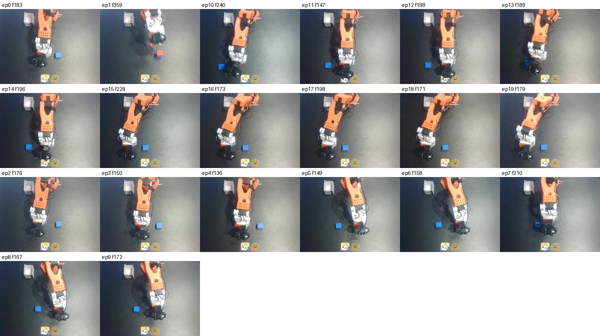

# robolabel

[](https://github.com/kevdozer1/robolabel/actions/workflows/ci.yml)
[](LICENSE)
[](pyproject.toml)

## What it does

robolabel reads a [LeRobot](https://github.com/huggingface/lerobot) robot-manipulation
dataset and uses a vision-language model to draft three things per episode: where each
subtask starts and ends, a 1–5 quality score, and a representative keyframe per subtask.
It then **measures those drafts against a human**, in plain numbers, instead of assuming
they are right. You watch the clips in a browser viewer, and the tool tells you how often
the model's boundaries, scores, and stated reasons actually match what you see. The output
is a parquet sidecar plus an export in LeRobot's own subtask format. The honest pitch is
not "good labels" — it is **drafts, plus an honest measurement of how good they are**.


## See it

**The verification viewer** (`robolabel inspect`) puts the human gold and every strategy
on parallel, color-coded boundary tracks over the video, with a tab that shows each
evidence string next to a thumbnail of the exact frame it cites — so you can check whether
the model's stated reason is true:

> _Capture your own:_ `robolabel inspect --data inspect_data/so101.json --source lerobot
> --target lerobot/svla_so101_pickplace --camera-key observation.images.side`
> (screenshot placeholder — see `REVIEW_GUIDE.md`).

**The query path** (`robolabel query`) proves the labels are usable — e.g. *show me every
grasp across the dataset* as a contact sheet:



## 60-second quickstart

```bash
pip install -e '.[lerobot]'           # core viewer needs no extra deps; lerobot for datasets
export GEMINI_API_KEY=...

# draft annotations with a grounded strategy (boundaries as frame indices + evidence):
robolabel annotate --source lerobot --target lerobot/svla_so101_pickplace \
  --provider gemini --strategy S2 --limit 5 --out ann

robolabel gate        --annotations ann                 # automatic red flags (never drops)
robolabel reliability --gold so101_gold.json            # VLM-vs-human agreement, once you review
robolabel query       --annotations ann --phase grasp --source lerobot \
                      --target lerobot/svla_so101_pickplace --out grasp.png
robolabel export      --annotations ann --format lerobot --out ann_lerobot   # LeRobot subtask convention
```

Providers: `gemini`, `openai`, local `qwen`, `mock`. Strategies `S0`..`S4` (`S2` is the
recommended default; `S0` is the cheap reproducible baseline). The offline `robolabel demo`
runs the whole pipeline with no API key.

## How well does it work

Measured on `lerobot/svla_so101_pickplace` against a 50-episode human gold set (30 tune /
20 held-out test). One caveat applies to every number: **one task family, one annotator's
gold, and the gold was built by correcting the baseline's drafts** (so it slightly favors
the baseline). Full writeup: [`STRATEGY_REPORT.md`](STRATEGY_REPORT.md).

- **Failure tail, eliminated.** Out of the box, **25% (5 of 20)** held-out episodes come
  back as a single "do the task" blob or as boundaries at uniform fifths of the duration.
  The grounded strategy brings that to **0 of 20**. This is the most robust result and it
  holds on held-out data.
- **Boundary placement, better — even though mean overlap isn't.** Mean segment-overlap
  IoU does *not* improve on held-out data (grounded **0.444** vs baseline **0.460**). But on
  the metric that matters for conditioning — landing on the actual transition frame — the
  grounded strategy hits **36% more** gold boundaries within ±5 frames (recall **0.307 vs
  0.226**). It gets the transitions right; it doesn't pad the average.
- **Quality scores: read with care.** The gold here is 49/50 "score 5", so a model that
  always says 5 scores 0.97–1.00 — above both Gemini Flash and Pro. The number that means
  something is the **catastrophic false-negative rate** (a human-5 scored ≤2, which would
  silently filter good data): Flash 3/30, Pro **1/30**.
- **The free baseline loses.** A proprioceptive segmenter from the gripper signal (no VLM,
  $0) scores 0.18–0.20 IoU — the VLM beats it by ~0.10–0.25, so the API cost buys something.
- **Generalization (fresh dataset).** On a second, never-touched dataset
  (`lerobot/svla_so100_stacking`, apache-2.0, no baseline-anchored gold), the grounded
  strategy produced **0 of 20** failure-band episodes, 5.2 segments/episode, and a
  frame-grounded evidence string on every boundary that referenced the *new* scene — so
  the **failure-band elimination is verified on two datasets** ([`FRESH_TRIAL_REPORT.md`](FRESH_TRIAL_REPORT.md)).
  The *subjective* numbers (boundary acceptance, phase accuracy, **evidence factual-accuracy**)
  are produced when you grade the clips blind in [`REVIEW_GUIDE.md`](REVIEW_GUIDE.md); until
  then they are **not yet claimed** here — see "What is not yet shown."

Every claim above is itemized with its evidence and status in [`CLAIMS.md`](CLAIMS.md).

## When to use it / when not

**Use it when** you have a LeRobot dataset, want VLM-drafted subtask/quality annotations,
and — crucially — want to *measure* how trustworthy they are before feeding them anywhere.
Use a grounded strategy when you never want a degenerate/uniform label in your data; use the
gate to surface episodes to re-check; use the export to hand boundaries to a LeRobot
consumer.

**Don't use it** as a labeling oracle (it isn't — measure first), as a format converter
(use a tool like forge), or as evidence that these annotations help training (they have not
been shown to — see below). If your dataset has real quality variance, re-tune the rubric
and re-measure; the defaults were tuned on tabletop pick-and-place.

## Related tools and when to use them

robolabel is **not** the first tool to put a VLM on robot demos. What it adds is a
specific combination: LeRobot-native output, per-call provider receipts and cost, a
*measured* strategy ablation, and a reliability report against human calibration.
Here is the honest neighborhood (each verified against its own repo/paper):

- **[LeRobot Annotate](https://github.com/huggingface/lerobot-annotate)** — Hugging Face's manual web UI for marking subtask segments and high-level dialogue on LeRobot episodes, persisting the canonical on-disk convention. *Use it when* you want a human to author/correct boundaries directly. robolabel **exports to its subtask convention** (`export --format lerobot`); the related in-`lerobot` SARM path auto-generates subtask annotations via a VLM but doesn't measure their reliability.
- **[ATLAS](https://arxiv.org/abs/2604.26637)** — a keyboard-centric GUI for human segmentation of long-horizon demos, with time-synchronized multi-view video + proprioception (force/torque, gripper). *Use it when* you need to see robot time-series alongside video while hand-segmenting. (Paper/tool; no released repo linked.)
- **[forge](https://github.com/arpitg1304/forge)** — a multi-format robot-data toolkit (RLDS/Open-X, LeRobot, GR00T, …) that converts, inspects, and runs **signal-level QC** scoring episodes from proprioception (smoothness, gripper chatter, saturation, …). *Use it when* you need format conversion or trajectory-quality QC — which is orthogonal to robolabel's *semantic* annotation reliability.
- **[RoboAnnotatorX](https://roboannotatex.github.io/)** (ICCV 2025) — a multimodal-LLM framework that auto-generates dense annotations for long-horizon robot video, shipping the RoboX-VQA benchmark. *Use it when* you want a research-grade annotation model + video-understanding benchmark, not a per-annotation reliability workflow on your own data.
- **[RoboInter](https://github.com/InternRobotics/RoboInter)** (ICLR 2026) — a semi-automatic GUI (SAM2 tracking + HITL) producing 10+ dense intermediate labels (masks, boxes, grasps, traces, subtasks). *Use it when* you need rich per-frame geometric labels at scale.
- **[UVD](https://github.com/zcczhang/UVD)** — a training-free decomposer that finds subgoal boundaries from phase shifts in a frozen visual representation (no language, no VLM). *Use it when* you want annotation-free subgoal indices to feed goal-conditioned BC/RL.
- **Generic labeling platforms — [CVAT](https://www.cvat.ai/)** (open-source CV labeling) and **[Encord](https://encord.com/)** (commercial multimodal labeling/curation SaaS). *Use them when* you need general-purpose video/data labeling; neither is LeRobot-aware nor measures VLM-draft reliability.

## What is not yet shown

Stated plainly so nobody assumes more than was measured:

- **Training utility.** Whether these conditioning annotations actually improve a
  downstream policy is **not demonstrated** — and in one preregistered, controlled test it
  did not ([`docs/why.md`](docs/why.md)). Do not treat the labels as a known training win.
- **Generalization beyond one task family.** The numbers above are SO-101 pick-and-place.
  The fresh stacking-dataset blind trial exists to test generalization; its per-boundary,
  per-phase, and **evidence factual-accuracy** numbers are produced when you grade it
  ([`REVIEW_GUIDE.md`](REVIEW_GUIDE.md)) — until then, treat generalization as untested.
- **Quality discrimination.** Cannot be evaluated on a dataset that is 49/50 one score;
  needs a dataset with real quality variance.
- **Driving a trainer off the export.** The LeRobot subtask export round-trips and every
  frame's index resolves correctly ([`docs/consumability.md`](docs/consumability.md)), but we
  write a metadata overlay, not a per-frame column in the binary data — so instantiating a
  full SARM/VLA dataloader on it is a next step, not a demonstrated capability.

## Status

Beta, single-author. Schemas are versioned but may change before 1.0. Linux and macOS are
supported (Windows is not a target). License: [Apache-2.0](LICENSE).
