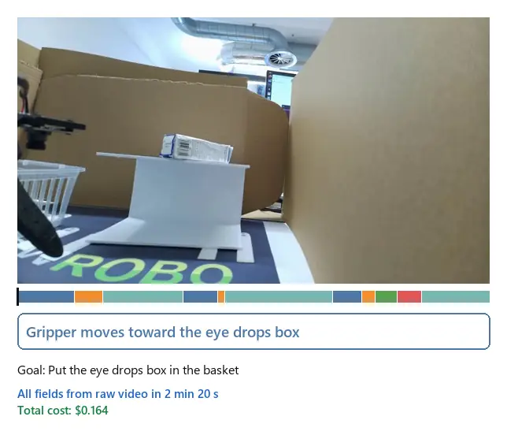
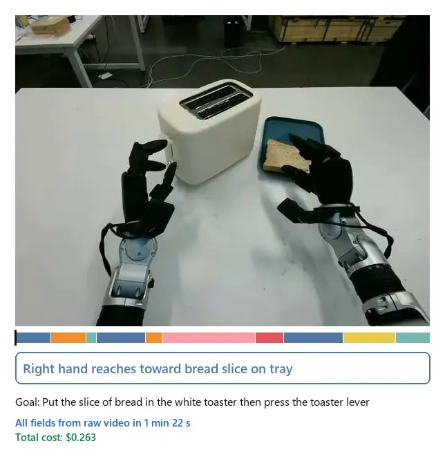
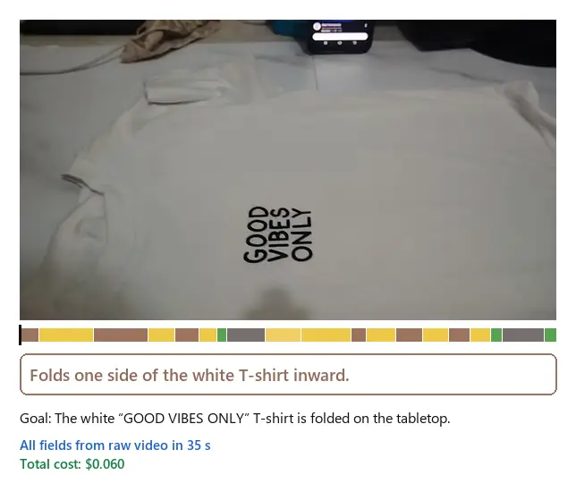
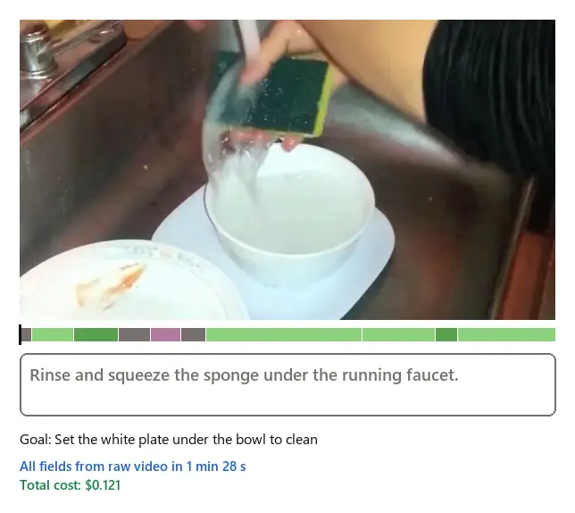

# robolabel

robolabel turns demonstration video into labels for training robot policies: the phases of the task
with their frame boundaries, each grasp attempt and whether it failed, and the goal as end states plus
a short command. It needs one camera's video; a robot's gripper signal is optional. It calls
vision-language models through OpenRouter and writes a parquet file.

<table>
  <tr>
    <td width="50%" valign="top">
      <a href="docs/figures/v11_robot_arm.webp"></a><br>
    </td>
    <td width="50%" valign="top">
      <a href="docs/figures/v11_humanoid.webp"></a><br>
    </td>
  </tr>
  <tr>
    <td width="50%" valign="top">
      <a href="docs/figures/v11_egocentric.webp"></a><br>
    </td>
    <td width="50%" valign="top">
      <a href="docs/figures/v11_third_person.webp"></a><br>
    </td>
  </tr>
</table>

Clips: ArmnetBench v0.1 and Unitree G1_Dex3_ToastedBread_Dataset (Apache-2.0), Eidon Tracker POV
(CC BY 4.0), "Washing Dishes" by Leet289 (CC BY-SA 4.0; that figure is shared under the same
license). Full credits are under [License and credits](#license-and-credits).

## Models compared

One full run per model on each of six clips: the four above, a robot hand drawing in simulation, and
a dance with no objects. Six clips and one rater are too few to pick a winner.

| Model | Median cost | Median time | Rating, video only | Rating, with robot signals | My ranking |
|---|--:|--:|--:|--:|--:|
| GPT-6 Astra | $0.522 | 1 min 32 s | 3.00 | 3.25 | 3.08 |
| Muse Spark 1.3 | $0.091 | 3 min 26 s | 3.17 | 2.75 | 3.04 |
| Claude Opus 5.5 | $0.149 | 46 s | 3.00 | 3.00 | 3.00 |
| GPT-6 Sol | $0.094 | 1 min 4 s | 2.83 | 3.25 | 2.96 |
| Gemini 3.8 Flash | $0.154 | 2 min 10 s | 2.83 | 2.75 | 2.81 |
| GPT-6 Luna | $0.006 | 1 min 6 s | 2.17 | 3.00 | 2.42 |

Ratings are one rater's overall score for the whole labeling, from 1 to 5. "Video only" is this
pipeline on the six clips, blind except for 6 outputs seen earlier with model names. "With robot
signals" is an earlier blind round on 4 SO-101 episodes in which the model also got the robot's
gripper signal. "My ranking" weights the two 70/30: a qualitative blend, not a statistic. Cost is the
whole pipeline's API cost for one clip at OpenRouter list prices on 2026-09-27. Time is the job's wall
time, rough because other jobs ran at the same time. Each run used one model for every step, with
`reasoning={"effort": "low", "exclude": True}`. 

The blended scores span 2.42 to 3.08, and every model gave unusable labels on at least two of the six
clips. Median cost runs from $0.006 to $0.522 per clip, a factor of more than 80. My personal ranking
does not factor in cost.

## Try it

Python 3.10 or newer (CI tests Linux on 3.10 and 3.12). This runs offline on a 7.7 s
SO-101 clip that ships with the repo:

```bash
git clone https://github.com/kevdozer1/robolabel && cd robolabel
pip install -e '.[video,eval]'    # PyAV decodes the clip; jsonschema checks model answers
mkdir -p clips/pickplace
cp demo/clips/pickplace.mp4 clips/pickplace/clip.mp4
echo "pink lego brick into the transparent box" > clips/pickplace/task.txt
```

```python
from robolabel.adapters.clip_folder import ClipFolderSource
from robolabel.providers.mock import MockProvider
from robolabel.schema_v7 import write_v11
from robolabel.vfirst import run_episode_v11

ep = ClipFolderSource("clips").episode("pickplace")  # clips/<id>/clip.mp4 and an optional task.txt
model = MockProvider()                                # offline placeholder answers, $0
out = run_episode_v11(ep, camera="video", caller=model, context={"episode_key": ep.episode_id})

for s in out["view"]["segments"]:
    print(s["start"], s["end"], s["phase_class"], s["phase_text"], s["outcome"])
print("goal:", out["view"]["goal_command"], "| cost:", out["view"]["cost_usd"])
print(write_v11(out["rows"], "run_out"))              # run_out/annotations.parquet
```

The mock labels describe nothing; they show the output format. To label the clip with a real model,
set `OPENROUTER_API_KEY` and replace the `model` line:

```python
from robolabel.providers.openrouter import OpenRouterProvider

model = OpenRouterProvider("google/gemini-3.8-flash")  # any OpenRouter model id that accepts images
```

This provider has no spending cap; see [Spend guard and cache](#spend-guard-and-cache).

The parquet file has one row per record, and `record_type` tells them apart (`episode_metadata`,
`subtask` for each phase, `attempt`, `requirement`, `scene_fact`, ...):

```python
from robolabel.schema_v7 import read_v11

df = read_v11("run_out")
print(df[df.record_type == "subtask"][["start_frame", "end_frame", "subtask_text", "phase_class", "outcome"]])
print(df[df.record_type == "episode_metadata"][["goal_objective", "goal_command", "review_status"]])
```

`out["view"]` holds the same labels as one plain-JSON dict, with each step's status, the cost and the
crawl log; robolabel does not save it.

## How it works

`robolabel.vfirst.run_episode_v11` labels one episode from one camera in these steps:

| Step | What it does | Model calls |
|---|---|---|
| Event source | candidate events: `none` (default), `motion` (pauses in the pixels) or `gripper` (the robot's gripper signal) | 0 |
| Inventory | object IDs and names from up to 8 evenly spaced frames | 1 |
| Coarse pass | every phase of the clip, from frames or native video | 1 |
| Crawl | each contact boundary refined to its onset frame | up to 3 per boundary, at most 12 boundaries |
| Scene facts | what is visible, held, and inside or on what, at the start, each boundary and the end | 1 |
| Goal | end-state requirements, `has_end_state` and `goal_command` | 1 |
| Checks | 13 rules, a risk score (the share of applicable rules that failed) and a review flag | 0 |

A call that fails or is refused does not stop the episode. The gap is listed in `repairs`, the risk
is set to 1.0, and the episode is routed for review.

The crawl refines contact boundaries. At 2 frames per second the coarse pass sees every 15th frame of
a 30 fps video, so its boundaries can be several frames off. For each boundary typed `close_start`,
`open_start`, `contact_start` or `contact_end`, the crawl shows 8 images and asks a narrow question,
such as "Which of these frames is the first where the fingers (gripper or hand) have started to
close?" It looks first over ±1 s around the proposal, then between the chosen image and the one
before it. An undecided boundary keeps the coarse frame, which `coarse_end_frame` always records.
`crawl=False` turns the crawl off.

A failure is labeled on the phase that failed. In a missed grasp the approach is `success` and the
grasp is `failed`, with `failure_type: missed_grasp`. That is why only grasp phases turn red in the
robot arm figure. `attempt_outcome`, repeated on each phase of an attempt, holds the result of the
whole attempt, so you can still drop failed attempts.

The goal is a list of end-state requirements, such as "the pink brick is inside the transparent
box", each `required`, `incidental` or `unsure`. `goal_command` renders the required object end
states through fixed templates (`Put <object> in <ref>`, `Put <object> on <ref>`, `Press <object>`,
`Turn on <object>`, `Set <object> to <value>`) joined with "then", with no model call. The humanoid
clip's command is "Put the slice of bread in the white toaster then press the toaster lever".
Requirements about the robot itself are left out, and the command is empty when no requirement
renders. `has_end_state` is false for an activity with no object end state, such as a dance.

## Results and limits

### Boundary timing

Grasp and release boundaries were scored on 60 development episodes of an SO-101 arm, 30 each from
`lerobot/svla_so101_pickplace` and `armnet/armnetbench_v01_lerobot_so101`. GPT-6 Luna ran the coarse
pass and the crawl; Gemini 3.8 Flash ran both sides of the native video row, without the crawl. The
models never saw the gripper signal; it served only as the truth, as the measured onset (from the
gripper's position) or the commanded onset (from the action, 3 to 4 frames earlier).

Every setup misses 65 to 72 percent of true gripper events: no predicted boundary lands within 1 s
of them. The crawl only moves boundaries the coarse pass proposed, so it cannot recover a missed one.

| Change | Scored against | Result |
|---|---|---|
| Crawl on vs off | measured onsets | better: F1 at 5 frames +0.077 [0.036, 0.119]; MAE no clear difference |
| Crawl on vs off | commanded onsets | worse: F1 at 5 frames -0.060 [-0.102, -0.017]; MAE +1.60 [0.85, 2.39] frames |
| Native video instead of frames (20 episodes) | measured onsets | worse: F1 at 5 frames -0.120 [-0.204, -0.042] |
| Motion hints vs none | measured onsets | no clear difference in F1 or MAE |

Against measured onsets, the crawl's gain came from `svla_so101_pickplace`. On
`armnetbench_v01_lerobot_so101` alone, F1 at 5 frames showed no clear difference and MAE was 1.3
frames worse.

<details>
<summary>How timing was scored</summary>

F1 at 5 frames counts a predicted boundary as correct when it pairs one to one with a true boundary
within 5 frames. MAE is the mean absolute error, in frames, of boundaries matched within 10 frames.
Brackets are 95 percent intervals from a paired cluster bootstrap over episodes. "No clear
difference" means the interval includes zero and its half-width is at most 0.05 for F1 or 1 frame
for MAE. These are exploratory results on development episodes, with no correction for multiple
comparisons.

</details>

### Not established

- Whether these labels help train a policy.
- The accuracy of phase text, targets, attempts, outcomes and goals, and any accuracy on humanoid or
  human video.
- The `gripper` event source. The timing test used the signal as the truth, so it did not score
  this source.
- Why native video scores worse. The model's host samples the video at a rate robolabel neither sets
  nor records.

## Reference

[SCHEMA.md](SCHEMA.md) describes the output columns and
[CONFIG.md](CONFIG.md#v11-video-first-experimental) every option. The pipeline is experimental and its
API may change. The package also contains an older pipeline, the `robolabel` command, documented in
CONFIG.md and SCHEMA.md.

### Options

<details>
<summary>Event sources, native video, a robot's gripper signal, timing runs and scoring</summary>

| Keyword of `run_episode_v11` | Default | Meaning |
|---|---|---|
| `event_source` | `none` | `none`, `motion` (pauses of at least 0.3 s in the pixels) or `gripper` |
| `l1` | None | the episode's signal record from `run_l1`, required with `gripper` and refused with any other source |
| `crawl` | True | False turns the crawl off |
| `crawl_caller` | None | a different model for the crawl; None uses `caller` |
| `coarse_mode`, `video` | `frames`, None | `video` sends the clip to the coarse pass as native video |
| `reasoning` | None | sent with every call, for example `{"effort": "low", "exclude": True}` |
| `scene_max_frames` | 8 | the inventory's frames, and the most keyframes for the facts |

The coarse pass treats events as hints, not boundaries to copy.

**Native video.** Only the coarse pass sees the video; the other steps still see frames. The model
must accept video input on OpenRouter. `video_part` returns the clip's own bytes when it is an H.264
mp4 of at most 60 s, else None; robolabel never encodes video. Continuing the example under
[Try it](#try-it):

```python
out = run_episode_v11(ep, camera="video", caller=model, coarse_mode="video",
                      video=ClipFolderSource("clips").video_part("pickplace"),
                      context={"episode_key": ep.episode_id})
```

**A robot's gripper signal.** With the `gripper` source, a grasp or release boundary the model ties to
a gripper event takes the signal's frame and is not crawled, robot end states the model left
undecided are read from the signal, and five more checks run. `run_l1` knows two gripper layouts,
`so101` and `libero`. A downloaded LeRobot v3.0 folder gives the episodes with their state and
action:

```python
from robolabel.adapters.lerobot_v3 import LeRobotV3Folder, LeRobotV3Source
from robolabel.layers.signal import calibrate, run_l1
from robolabel.providers.openrouter import OpenRouterProvider
from robolabel.schema_v7 import write_v11
from robolabel.vfirst import run_episode_v11

model = OpenRouterProvider("google/gemini-3.8-flash")
folder = LeRobotV3Folder("path/to/dataset")          # a downloaded LeRobot v3.0 dataset
episodes = [0, 1, 2]
source = LeRobotV3Source(folder, episodes, family="mydata")
cal = calibrate(folder.stats, "so101", folder.fps)   # or "libero"
rows = []
for i in episodes:
    ep = source.episode(i)
    l1 = run_l1(ep.extra["state"], ep.extra["action"], cal, episode_key=ep.episode_id)
    out = run_episode_v11(ep, camera=ep.camera_key, caller=model, event_source="gripper", l1=l1,
                          context={"episode_key": ep.episode_id})
    rows += out["rows"]
print(write_v11(rows, "run_out/mydata"))
```

**Timing runs.** `robolabel.vfirst.run_timing` runs only the event source, the coarse pass and the
crawl, and returns the segments before and after the crawl, the crawl log and the cost.

**Scoring.** `robolabel.eval.temporal.t1_episode` matches predicted and true boundary frames one to
one within `tau` frames:

```python
from robolabel.eval.temporal import t1_episode

print(t1_episode([10, 50, 90], [12, 70, 95], tau=5)["f1"])  # 0.666667: 2 of 3 matched
```

Fixed values (frame rate, frame caps, image size, crawl caps) are in
[CONFIG.md](CONFIG.md#fixed-values), and the clip folder layout in
[CONFIG.md](CONFIG.md#clip-folders).

</details>

### Spend guard and cache

<details>
<summary>Example and rules</summary>

```python
from robolabel.eval.receipts import JsonlWriter, ResponseCache
from robolabel.providers.openrouter import OpenRouterProvider
from robolabel.spend_guard import GuardConfig, SpendGuard

MODEL = "google/gemini-3.8-flash"
guard = SpendGuard(GuardConfig(run_cap=5.00,              # stop this run at $5
                               available_at_start=20.00,  # credit left on the key now
                               balance_floor=2.00),       # never take the key below $2
                   "runs/spend_ledger.jsonl")
model = OpenRouterProvider(MODEL, guard=guard,
                           # USD per million tokens (input, output): the list price on 2026-09-27,
                           # promotional until 2026-12-31; check the current price
                           prices={MODEL: (0.75, 3.75)},
                           cache=ResponseCache("runs/responses.jsonl"),
                           receipts=JsonlWriter("runs/receipts.jsonl"))
# ... run_episode_v11(ep, camera="video", caller=model, context={"episode_key": ep.episode_id})
guard.close()
```

- Before every HTTP attempt, retries included, the provider reserves the attempt's worst case: the
  estimated input tokens at the input price plus `max_tokens` at the output price. `prices` must hold
  the model's current list prices. The provider also sends 1.5 times them to OpenRouter as the
  highest price it will pay.
- The guard refuses a reservation, and nothing is sent, when it would take the committed total past
  `run_cap`, past `available_at_start` minus `balance_floor`, or past a cap in `bucket_caps` (keyed
  by the context's `bucket`, default `sweep`) or `model_caps` (keyed by the context's `model_key`,
  `sweep` bucket only). A refused call has status `refused`, and the episode goes on without it.
- After the guard stops, for example on an HTTP 402 for insufficient credits or a key limit, every
  later call has status `stopped` and the episode makes no more model calls.
- After a response, the call's reported cost replaces the reservation. A timeout, a dropped
  connection, a 5xx or a 200 without a cost keeps its reservation as spent. A request OpenRouter
  rejects before any generation is recorded at $0.
- Every event is appended to the JSONL ledger and fsynced. A restarted guard replays it, and one
  process at a time may reserve against a ledger.

`ResponseCache` answers a repeated request (same provider, model, prompt, settings and images)
without an HTTP call. `JsonlWriter` appends one receipt per call with tokens, cost and status.
Neither holds the key, request headers or image bytes.

</details>

### Install and tests

Extras: `video` (PyAV) decodes clips and LeRobot v3.0 folders, `eval` adds scoring and answer
checks, `hub` adds Hugging Face downloads, and `dev` adds pytest and ruff. The tests need no network
and no key: `pip install -e '.[dev,eval,video,hub]' && pytest`.

## License and credits

robolabel is licensed under [Apache-2.0](LICENSE).

The figures show clips from these sources, with robolabel's labels drawn over them. Each figure keeps
its source's license:

- Robot arm (`docs/figures/v11_robot_arm.webp`): ArmnetBench v0.1
  ([armnet/armnetbench_v01_lerobot_so101](https://huggingface.co/datasets/armnet/armnetbench_v01_lerobot_so101)),
  [Apache-2.0](https://www.apache.org/licenses/LICENSE-2.0).
- Humanoid (`docs/figures/v11_humanoid.webp`): Unitree Robotics,
  [G1_Dex3_ToastedBread_Dataset](https://huggingface.co/datasets/unitreerobotics/G1_Dex3_ToastedBread_Dataset),
  [Apache-2.0](https://www.apache.org/licenses/LICENSE-2.0).
- Egocentric (`docs/figures/v11_egocentric.webp`): Eidon Tracker POV
  ([eidon-ai/tracker-pov](https://huggingface.co/datasets/eidon-ai/tracker-pov)) by Eidon AI (Solidic
  Labs Inc), [CC BY 4.0](https://creativecommons.org/licenses/by/4.0/); recording 8266, cut and
  downscaled.
- Third person (`docs/figures/v11_third_person.webp`): "Washing Dishes" by Leet289,
  [Wikimedia Commons](https://commons.wikimedia.org/wiki/File:Washing_Dishes.webmhd.webm),
  [CC BY-SA 4.0](https://creativecommons.org/licenses/by-sa/4.0/); cut and re-encoded. This figure is
  an adaptation and is shared under CC BY-SA 4.0.

The clips in `demo/clips` come from the Hugging Face datasets `lerobot/svla_so101_pickplace`,
`Ishah8840/so101_pouring` and `the-sam-uel/bi-so101-fold-horizontal-set-1`; each clip's JSON file in
`demo/` names its source episode.

robolabel only decodes video with PyAV and bundles neither PyAV nor FFmpeg. PyAV's PyPI wheels include
an FFmpeg build with GPL codecs; for an LGPL-only setup, build PyAV (`pip install av --no-binary av`)
against an FFmpeg built without GPL components and with an AV1 decoder such as libdav1d.
