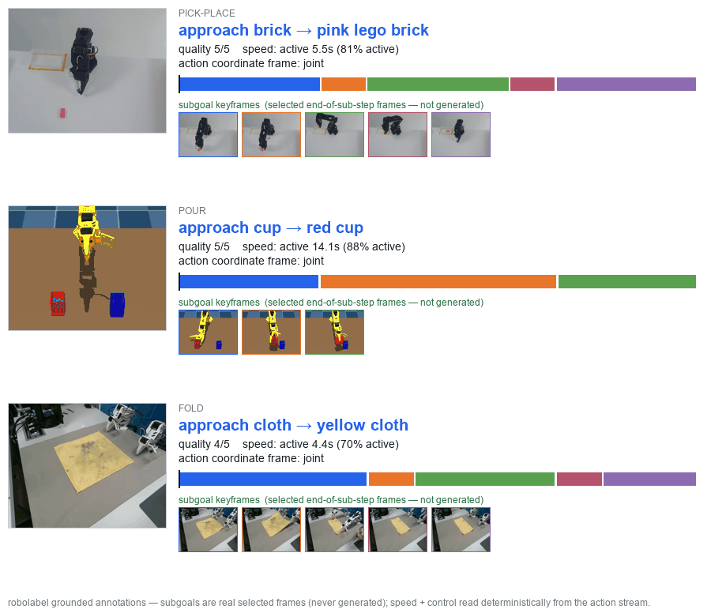

# robolabel

robolabel drafts the labels a robot policy is conditioned on (subtasks, goals, grasp attempts and
their outcomes, keyframes) from robot or human demonstration video, using vision-language models. It
reads LeRobot datasets and plain video clips, writes a parquet file, and scores its drafts against
human labels and robot signals instead of assuming they are right.

<table>
  <tr>
    <td width="50%" valign="top">
      <a href="docs/figures/v11_robot_arm.webp"></a><br>
      SO-101 arm, task text "Put the eye drops into the basket" (23.7 s). Three grasp attempts; the
      first two fail, and only their grasp phases get the light red box (the second one is brief).
      Labeled in 2 min 20 s for $0.164.
    </td>
    <td width="50%" valign="top">
      <a href="docs/figures/v11_humanoid.webp"></a><br>
      Unitree G1 humanoid with dexterous hands, putting bread in a toaster (20.7 s). Labeled in 2 min
      for $0.144.
    </td>
  </tr>
  <tr>
    <td width="50%" valign="top">
      <a href="docs/figures/v11_egocentric.webp"></a><br>
      Head-mounted camera, a person folding a T-shirt (30 s). Labeled in 35 s for $0.060.
    </td>
    <td width="50%" valign="top">
      <a href="docs/figures/v11_third_person.webp"></a><br>
      Close third-person view, hands washing dishes (30 s). Labeled in 1 min 28 s for $0.121.
    </td>
  </tr>
</table>

**What you are looking at.** Each clip was labeled by the experimental
[video-first pipeline (v1.1)](#experimental-video-first-v11) with no robot signal and no motion hints
(event source `none`). The model saw frames at up to 2 per second, at most 48 per clip, so the two
30 s human clips got about 1.6 per second. The two robot clips also came with their dataset's one-line
task text ("Put the eye drops into the basket", "toasted bread"). The human clips had none, so their
phases and goals come from the video alone; the dishes video has on-screen step titles, which the
model also saw. Under each clip:

- a timeline of the labeled phases, with a playhead. Colors are phase classes: approach blue, grasp
  orange, transport green, release red, retract teal, and the other classes in their own colors. Red
  on the timeline is release, not failure;
- the current phase's label in the model's own words, in a box of the phase's color. The box is
  filled light red when that phase failed, and failure shows nowhere else;
- `Goal:`, the goal as a training command (`goal_command`). Commands come from fixed templates and can
  read awkwardly: the dishes clip gets "Set the white plate under the bowl to clean". The T-shirt clip
  has none: its one requirement was marked `unsure`, so its line shows the end-state sentence instead;
- "All fields from raw video in ...", the wall time of every step of the pipeline on that clip, from
  listing the objects to the final checks, and "Total cost", the API cost of that run.

The labels come from vision-language models called through OpenRouter. Six models labeled each clip,
and each figure shows the output picked by hand as the best of the six, so these are examples, not a
benchmark. Measured so far, on 60 SO-101 arm episodes only: the step that refines each boundary (the
crawl) raises boundary F1 against the measured gripper onset and lowers it against the commanded one,
and every setup still leaves 65 to 72 percent of true gripper events with no predicted boundary within
1 s. Nothing has been measured on humanoid or human video. Details are under
[Results and limits](#results-and-limits).

Clips: ArmnetBench v0.1 and Unitree G1_Dex3_ToastedBread_Dataset (Apache-2.0), Eidon Tracker POV
(CC BY 4.0), "Washing Dishes" by Leet289 (CC BY-SA 4.0, and that figure is shared under the same
license). Full credits are under [License and credits](#license-and-credits).

## Try it

Python 3.10 or newer, on Linux or macOS.

### Offline, with no key (stable pipeline)

```bash
git clone https://github.com/kevdozer1/robolabel && cd robolabel
pip install -e .
robolabel demo --out demo_out
```

This runs the stable pipeline on three synthetic episodes with a mock model and writes
`demo_out/annotations.parquet`. The labels pass the schema but describe nothing; the run shows the
output format. The summary reports `"gate_passed": false` because the automatic checks flag the mock
labels, which is expected. To look at the result:

```python
import pandas as pd

df = pd.read_parquet("demo_out/annotations.parquet")
print(df[df.record_type == "subtask"][["episode_id", "start_frame", "end_frame", "subtask_text"]])
```

The video-first example below also runs offline, with the mock model in place of OpenRouter.

### Label a clip with the video-first pipeline

You need an [OpenRouter](https://openrouter.ai) key. The pipeline reads one clip per folder: a
`clip.mp4` and, optionally, a one-line `task.txt`. The repo ships a 7.7 s SO-101 clip you can use:

```bash
pip install -e '.[video,eval]'    # PyAV to decode clips, jsonschema to check answers
export OPENROUTER_API_KEY=...

mkdir -p clips/pickplace
cp demo/clips/pickplace.mp4 clips/pickplace/clip.mp4
echo "pink lego brick into the transparent box" > clips/pickplace/task.txt
```

```python
from robolabel.adapters.clip_folder import ClipFolderSource
from robolabel.providers.openrouter import OpenRouterProvider
from robolabel.schema_v7 import write_v11
from robolabel.vfirst import run_episode_v11

clips = ClipFolderSource("clips")
ep = clips.episode("pickplace")                   # one camera, named "video"
model = OpenRouterProvider("vendor/model-name")   # any OpenRouter model id that accepts images
out = run_episode_v11(ep, camera="video", caller=model,
                      context={"arm": "v1.1", "episode_key": ep.episode_id})

view = out["view"]
for s in view["segments"]:
    print(s["start"], s["end"], s["phase_text"], s["outcome"])
print("goal:", view["goal_command"])
print("cost (USD):", view["cost_usd"])
print(write_v11(out["rows"], "run_out/v11"))      # run_out/v11/annotations.parquet
```

To try the same code offline first, replace `OpenRouterProvider(...)` with `MockProvider()` from
`robolabel.providers.mock`: it returns placeholder labels at no cost and needs no key.

Built this way, the OpenRouter provider has no spending limit. The four figure runs cost $0.06 to
$0.16 per clip, depending on the model and the clip length. To cap spending and cache answers, see
[Spend guard and cache](#spend-guard-and-cache). For more clips, add folders in the same layout. For
a LeRobot dataset, or a robot that records its gripper, see [v1.1 details](#v11-details).

The parquet file has one row per record, with a `record_type` column (`episode_metadata`, `subtask`,
`attempt`, `requirement`, `scene_fact`, `check`, ...):

```python
from robolabel.schema_v7 import read_v11

df = read_v11("run_out/v11")   # also reads older files; v1.1 columns are null where a file has none
phases = df[df.record_type == "subtask"]
print(phases[["start_frame", "end_frame", "subtask_text", "phase_class", "end_event", "boundary_source", "outcome"]])
print(df[df.record_type == "episode_metadata"][["goal_objective", "goal_command", "episode_outcome", "review_status"]])
```

One unit has three names: a phase in the figures, a segment in the view (with its `phase_text`), and
a `subtask` row in the parquet (with the same text in `subtask_text`). `out["view"]` holds the same
labels as one plain-JSON dict, plus the status of each step, the cost and the crawl log. robolabel
does not write it to disk; save it if you want it.

The CLI's `export` and `review` are built and tested for v6 files; for v1.1 output, read the parquet
as above. The figures were drawn by a script that is not part of the package.

## How it works

robolabel has three pipelines. The figures come from the newest, v1.1: the name of the design,
carried in each row's `pipeline_version`, not a package release.

| pipeline | status | entry point | input | writes |
|---|---|---|---|---|
| v6 | stable | the `robolabel` CLI (`run`, `annotate`, `review`, `export`, ...) | a LeRobot dataset or a folder of videos | schema v6 parquet, and an export in LeRobot's subtask convention |
| V-lite | experimental | `robolabel.vlite.run_episode` (Python) | robot episodes with a gripper signal (`so101` or `libero` layout) | schema v7 |
| v1.1, video first | experimental | `robolabel.vfirst.run_episode_v11` (Python) | any video, one camera; a robot signal is optional | schema v7 plus 11 optional columns |

A schema version names the parquet's column layout; [SCHEMA.md](SCHEMA.md) has each one. The
experimental pipelines have no CLI subcommand yet, and their API may change. They change nothing in
what the CLI writes, and every older file still reads.

### Experimental: video first (v1.1)

Every step needs only one camera's video. A robot signal is optional: when present, it supplies
candidate events and robot end states. So the pipeline runs on robots without gripper channels, on
humanoids and people, and on tasks that are not pick and place.

`run_episode_v11` labels one episode in this order:

| step | what it does | model calls |
|---|---|---|
| event source | typed candidate events from `none` (the default: nothing), `motion` (pauses in the camera's pixels) or `gripper` (the robot's gripper signal) | none |
| inventory | object IDs and names from up to 8 evenly spaced frames | 1 |
| coarse pass | every segment of the clip, from frames or from native video | 1 |
| crawl | each contact boundary refined to its onset frame | at most 3 per boundary, at most 12 boundaries per episode |
| scene facts | what is visible, held, inside or on top of what, at the start, each boundary and the end (at most 8 frames); skipped when the inventory is empty | 1 |
| goal | the goal as end-state requirements, plus `has_end_state` and `goal_command` | 1 |
| checks | 13 rule checks, an episode risk (the share of applicable checks that failed) and a route-for-review flag | none |

A call that fails or is refused does not end the episode. The gap is listed in `repairs`, and the
episode gets risk 1.0 and is routed for review. The output is a view record and v7 rows with the v1.1
columns, which `robolabel.schema_v7.write_v11` writes to `annotations.parquet`. Every column is in
[SCHEMA.md](SCHEMA.md#v11-additions-video-first-experimental), every option in
[CONFIG.md](CONFIG.md#v11-video-first-experimental).

#### The crawl

At 2 frames per second the coarse pass sees every 15th frame of a 30 fps video, so its boundaries can
land several frames off. The crawl refines every boundary typed `close_start`, `open_start`,
`contact_start` or `contact_end` with narrow questions over 8 images, such as "Which of these frames
is the first where the fingers (gripper or hand) have started to close?" The next segment starts at
the onset it finds. The segment that ends there gets `boundary_source: crawl`, and its
`coarse_end_frame` keeps the original proposal. A boundary the crawl cannot decide keeps its coarse
frame. The crawl uses the coarse model unless you pass `crawl_caller=`; `crawl=False` turns it off.

#### Failures sit on the phase that failed

In a missed grasp, the approach that reached the object is `success` and the grasp is `failed`, with
`failure_type: missed_grasp`. That is why only the failed grasps turn red in the robot arm figure.
The result of the whole attempt is in `attempt_outcome` on each of its phases, so a consumer can still
drop failed attempts entirely. After a failed grasp the labels expect the fingers to reopen
(`open_start`), a `retract` if the arm backs off, then the next attempt's `approach`.

#### Goals as end states, plus a command

The goal is a list of end-state requirements ("the pink brick is inside the transparent box", "the
gripper is open"), each `required`, `incidental` or `unsure`. `goal_objective` is kept a state
sentence. `goal_command` is rendered from the required object end states by fixed templates
(`Put <object> in <ref>`, `Put <object> on <ref>`, `Press <object>`, `Turn on <object>`,
`Set <object> to <value>`), joined with "then", with no model call. It is the text meant for training
prompts: the pink brick required inside the transparent box, plus an open gripper, gives "Put the
pink brick in the transparent box". Robot items never appear in it, and it is empty when nothing
renders. `has_end_state` is false for an activity with no object end state, such as a wave.

<details>
<summary>The coarse pass, the crawl's stages and the event sources in detail</summary>

#### Coarse pass

One call sees the clip as frames at 2 per second (first and last included, at most 48, long side at
most 448 px) or as native video. Clips longer than about 24 s are sampled more sparsely. For each
segment it returns:

- `phase_text`, the phase in open text, and `phase_class`, one of `approach`, `grasp`, `transport`,
  `release`, `retract`, `press`, `pour`, `insert`, `fold`, `wipe`, `push`, `pull`, `rotate`, `open`,
  `close` or `other`;
- `end_event`, the type of the boundary at the segment's end: `close_start` (the fingers start to
  close), `open_start`, `contact_start` or `contact_end` (touches where the fingers neither close nor
  open, such as a pressed button or a wipe) or `other`;
- the target and destination, the attempt index, and the outcome.

Post-processing is deterministic and logs every repair: segments are made contiguous, times become
frames, and the failure convention above is applied.

#### Crawl stages

1. Stage 1 shows 8 frames evenly spaced over ±1.0 s around the proposed boundary and asks which is the
   first to show the event.
2. Stage 2 shows the frames between that image and the one before it, at native spacing when they fit
   in 8, otherwise evenly spaced.

The answer is one image index. Each boundary's frames, answers, cost and flags are in the view's
`crawl_log` ([flags](SCHEMA.md#crawl-log-flags-v11)).

#### Event sources

| source | reads | use it when |
|---|---|---|
| `none` (default) | nothing | any video, and whenever the robot signal is the truth you score against |
| `motion` | the camera's pixels: pauses of at least 0.3 s, free and deterministic | you want pause hints on any video; they have not helped so far (see results) |
| `gripper` | the robot's `observation.state` and `action`, through `robolabel.layers.signal.run_l1` | the robot records its gripper in a layout robolabel knows (`so101`, `libero`) |

The coarse pass sees events as hints, not boundaries to copy. With `gripper`, a grasp or release
boundary that the model ties to a gripper event takes the signal's frame and is not crawled, and
robot end states the model left undecided are read from the signal. `run_episode_v11` raises an error
if you pass a signal (`l1=`) with any other source, so a signal meant as truth cannot leak into the
labels.

</details>

## Results and limits

### Boundary timing on robot data (v1.1)

How close do v1.1's grasp and release boundaries land to the real ones? The test set is 60
development episodes of an SO-101 arm, 30 each from `lerobot/svla_so101_pickplace` and
`armnet/armnetbench_v01_lerobot_so101`, none from the held-out set. The models never saw the robot's
gripper signal; it was used only as the truth, in two forms: the measured onset (from the gripper's
position reading) and the commanded onset (from the action, 3 to 4 frames earlier).

The crawl asks for the first frame where the fingers visibly start to close or open. Against the
measured onset that raised F1 at 5 frames (MAE showed no clear difference); against the commanded
onset it made timing worse. Against the measured onset, frames beat native video, and motion hints
did not help. Every setup still misses most events: **65 to 72 percent of the true gripper events
have no predicted boundary within 1 s.** The crawl only moves boundaries the coarse pass proposed, so
it cannot recover a missed one.

| change | scored against | result |
|---|---|---|
| crawl on vs off | measured onsets | F1 at 5 frames +0.077 [0.036, 0.119], 60 episodes: clear difference (better). MAE: no clear difference |
| crawl on vs off, on a second model's coarse proposals | measured onsets | F1 at 5 frames +0.115 [0.028, 0.212], 20 episodes: clear difference (better). MAE: inconclusive |
| crawl on vs off | commanded onsets | F1 at 5 frames -0.060 [-0.102, -0.017], 60 episodes: clear difference (worse). MAE +1.60 [0.85, 2.39] frames: clear difference (worse) |
| crawl on vs off, on a second model's coarse proposals | commanded onsets | F1 at 5 frames -0.177 [-0.240, -0.109], 20 episodes: clear difference (worse). MAE +1.60 [0.37, 2.85] frames: clear difference (worse) |
| native video instead of frames, in the coarse pass | measured onsets | F1 at 5 frames -0.120 [-0.204, -0.042], 20 episodes: clear difference (worse) |
| motion hints vs none | measured onsets | F1 at 5 frames +0.019 [-0.022, 0.059], MAE +0.34 [-0.29, 0.99] frames, 60 episodes: no clear difference |

F1 at 5 frames matches predicted and true boundaries one to one within 5 frames. MAE is the mean
absolute error, in frames, of the boundaries matched within 10 frames; unmatched events add nothing
to it, so read it together with the miss rate. Brackets are 95 percent intervals from a paired
cluster bootstrap over episodes. "Clear difference" means the interval excludes zero. "No clear
difference" means it includes zero and its half-width is at most the smallest effect declared in
advance (0.05 for F1, 1 frame for MAE); "inconclusive" means it includes zero and is wider than that.
These are exploratory results on development episodes, with no correction for the number of
comparisons.

What to take from it: if your training target is the measured gripper onset, keep the crawl on. If it
is the commanded onset, turn it off (`crawl=False`). Either way, plan to review the boundaries.

### Stable pipeline accuracy (v6)

Scored against a 50-episode human gold set on `lerobot/svla_so101_pickplace` (one task family, one
annotator, built by correcting the baseline). The held-out comparison is 20 episodes. Its grounded
run used Gemini 2.5 Pro with strategy `S2` and its baseline Gemini 2.5 Flash with `S0`, so the model
changed too.

- The grounded strategy (each segment names the object it acts on; see
  [below](#the-stable-pipeline-v6)) removes degenerate "one blob" or "uniform fifths" segmentations:
  5 of 20 held-out episodes with the baseline, 0 of 20 grounded, and 0 of 20 on a fresh stacking set.
  With the same model (Flash) on development episodes: 12 of 30 against 0 of 30.
- Boundary recall within ±5 frames rose from 0.226 to 0.307 (14 and 19 of 62 gold boundaries), but
  the 95 percent interval of the difference, [-0.05, 0.21], includes zero.
- Mean segment-overlap IoU is unchanged (0.444 versus 0.460).

### Cost

| setup | cost | basis |
|---|---|---|
| v1.1, whole pipeline, the four figure clips (20.7 to 30 s each) | $0.060 to $0.164 per clip | one run per clip, of the output picked as best |
| v1.1 timing passes only: frames at 2 per second plus the crawl, one small model for both | about $3.26 per 1,000 episodes | the timing experiment; the cheapest setup that improved timing |
| v6, all modules, Gemini 2.5 Flash | about $20 to $28 per 1,000 episodes | measured, from per-call receipts |
| v6 with Gemini's batch tier and prompt caching | about $6 to $10 per 1,000 | estimated from list prices, not measured |

The figure costs are those of the runs picked as best; the other models cost more or less. The $3.26
covers only the coarse pass and the crawl, with one small model, on SO-101 episodes, so it is a floor,
not an estimate for the whole pipeline.

### Not established yet

- Whether any of these labels make a better policy. The one preregistered training test so far did not
  support it.
- The accuracy of v1.1's phase text, targets, attempts, outcomes and goals. The timing experiment
  scored boundaries only.
- Any v1.1 result on humanoid or human video. Every accuracy number above comes from SO-101 arm
  episodes; the humanoid and human figures are single hand-picked clips.
- The `gripper` event source. The timing experiment used the signal as the truth, so it did not
  score this source.
- A ranking of models. None is claimed.
- Native video timing: the model's host samples the video at a rate robolabel neither sets nor
  records.

## The stable pipeline (v6)



The `robolabel` CLI drafts, per episode, grounded `phase → target` subtasks, an episode quality score,
optional speed and control metadata, and subgoal keyframes, plus dataset-level curation. The set
follows the π0.7 data recipe (subtask language, episode quality, speed and subgoal images) with one
change: subgoal keyframes are real frames selected from the episode, never generated. The control
line in the figure (`joint` or `end-effector`) is read from the action stream, not inferred.

```bash
pip install -e '.[lerobot]'
export GEMINI_API_KEY=...

robolabel run --config configs/run_min.yaml               # segmentation + quality on 5 episodes
robolabel review --annotations run_out/min --gold gold.json \
  --source lerobot --target lerobot/svla_so101_pickplace    # correct the drafts in a browser
robolabel reliability --gold gold.json                    # how far the drafts are from your corrections
robolabel export --annotations run_out/min --format lerobot --out run_out/min_lerobot
```

For your own LeRobot dataset, add `--target your-org/your-dataset` (and optionally `--out` and
`--max-episodes`) to `robolabel run`. Camera, fps, control space and the arm and gripper dimensions
are detected from its metadata, and `run` prints what it found. A folder of plain videos needs no
config for the default modules, and one small JSON for speed and control; see
[PORTING.md](PORTING.md). `robolabel review` creates `gold.json` on first use and keeps your edits
when you run it again.

A grounded segment names the object it acts on, so two cubes do not both come back as a bare
"approach":

```text
approach      → red cube    frames 0-41     "gripper descends toward the red cube"
grasp         → red cube    frames 42-70    "fingers close on the red cube"
transport     → blue cube   frames 71-119   "red cube lifted over the blue cube"
release-place → blue cube   frames 120-168  "red cube set on top of the blue cube"
retract                     frames 169-199  "arm withdraws, gripper empty"
```

The three clips in the figure are bundled in [`demo/`](demo/). `python demo/demo.py` prints their
annotations and redraws the figure with no key and no download (install the `lerobot` extra, or
`pip install 'imageio[ffmpeg]'`).

<details>
<summary>Commands</summary>

| command | does |
|---|---|
| `run --config run.yaml` | the config-driven pipeline; see [CONFIG.md](CONFIG.md) |
| `annotate` | the VLM labelers over a dataset, with a strategy from `S0` (baseline) to `S4` |
| `review` | a browser page to watch, scrub and correct the drafts; creates or updates the gold file |
| `reliability` | agreement between the drafts and a gold file |
| `gate` | automatic red flags on an annotation set; never drops an episode |
| `query` | every segment of one phase as a contact sheet, or the episodes that need review |
| `export` | JSONL, or LeRobot's subtask convention |
| `cost` | token and USD accounting from the per-call receipts |
| `enrich` | adds the deterministic control and retrieved-subgoal fields |
| `demo` | the offline run with the mock provider |
| `inspect`, `gallery`, `trial-report` | viewers for strategy comparisons; undocumented |

```bash
robolabel annotate --source lerobot --target lerobot/svla_so101_pickplace \
  --provider gemini --strategy S2 --limit 5 --out ann
robolabel gate  --annotations ann
robolabel query --annotations ann --phase grasp --source lerobot \
  --target lerobot/svla_so101_pickplace --out grasp_sheet.png
robolabel cost  --annotations ann
```

</details>

<details>
<summary>Modules</summary>

A run config has a `run` block (dataset, model, probe size, output folder) and a `modules` block in
which every module is an independent toggle. Without `modules`, it runs segmentation and quality.

| module | default | produces |
|---|---|---|
| `segmentation` | on | grounded `phase → target` subtask boundaries (open vocabulary; `closed` and `baseline` available) |
| `quality` | on | episode quality 1 to 5 (VLM) |
| `speed` | off | motion-defined active duration (`active_frames`, `active_seconds`, `active_fraction`) plus a corpus-relative fast, medium or slow tier |
| `subgoals` | off | the real end-of-sub-step keyframe (a pointer); optionally a same-phase keyframe retrieved from another episode |
| `control` | off | `control_modality` (joint or end-effector frame) plus the per-segment `active_dof` set (which component groups move) |
| `novelty` | off | per-episode novelty (distance in a cheap frame embedding) |
| `curation` | off | `curation_value = f(quality, novelty)` plus optional corpus-relative tiers |

Only `segmentation` and `quality` call a model; the rest are deterministic and cost nothing. Modules
run in dependency order, dataset-level ones (novelty, curation, retrieval) after the per-episode
pass. Curation writes its tier (`full`, `reduced` or `minimal`, or `keep` or `cut`) as an overlay and
never drops or re-encodes data; tiers stay empty when the population is too small or too uniform to
rank. Full reference: [CONFIG.md](CONFIG.md#modules).

```yaml
run:
  dataset: { source: lerobot, target: lerobot/svla_so101_pickplace }   # camera_key: auto
  model:   { provider: gemini, name: gemini-2.5-flash }
  probe:   { max_episodes: 5 }
  out: run_out/full
modules:
  segmentation: { enabled: true, strategy: grounded, vocabulary: open }  # closed = S2; baseline = S0
  quality:      { enabled: true }
  speed:        { enabled: true }
  subgoals:     { enabled: true, retrieval: true }
  control:      { enabled: true }
  novelty:      { enabled: true }
  curation:     { enabled: true, compress: true }
```

</details>

<details>
<summary>LeRobot export</summary>

`robolabel export --format lerobot` writes LeRobot's subtask convention (`meta/subtasks.parquet` and
`meta/episodes_subtasks.parquet`), round-trip tested through lerobot's own `load_subtasks`, so every
frame's `subtask_index` resolves to its segment. It composes with the manual
[LeRobot Annotate](https://github.com/huggingface/lerobot-annotate) tool: draft with robolabel,
correct the flagged cases by hand, then train. `--format jsonl` writes one consolidated record per
episode. What survives the export and what stays in the parquet file is in
[SCHEMA.md](SCHEMA.md#lerobot-subtask-convention-export).

</details>

## Reference

[SCHEMA.md](SCHEMA.md) has every output column, [CONFIG.md](CONFIG.md) every option and
[PORTING.md](PORTING.md) how to point robolabel at a new dataset.

### Install extras

The core needs only numpy, pandas, pyarrow, pillow, pyyaml and requests. Extras add LeRobot
datasets, video decoding, scoring, a local model and dev tools.

<details>
<summary>The extras</summary>

| extra | installs | needed for |
|---|---|---|
| `lerobot` | `lerobot` | v6 on LeRobot datasets, and clip frames in `robolabel review` |
| `video` | `av` (PyAV, decode only) | reading a LeRobot v3.0 folder (every camera plus `observation.state` and `action`) or a folder of clips directly, without `lerobot` |
| `eval` | `scipy`, `jsonschema` | the scoring code in `robolabel.eval`; the OpenRouter provider also checks every answer against its JSON Schema when `jsonschema` is installed |
| `hub` | `huggingface_hub` | downloading a dataset at a pinned revision, for example with `snapshot_download(repo_id, repo_type="dataset", revision=..., local_dir=...)`; robolabel does not import it |
| `qwen` | `torch`, `transformers`, `accelerate`, `qwen-vl-utils` | the local Qwen2.5-VL provider (GPU recommended) |
| `dev` | `pytest`, `ruff` | tests and lint |

</details>

### Providers

v6 runs with `gemini` (the default), `openai`, `qwen` (local), `openrouter` and `mock`. V-lite and
v1.1 call a model through `.call(CallRequest)`, which only `openrouter` and `mock` implement so far;
any object with that method works as `caller`. A provider is one file: subclass `VLMProvider` and
call `register_provider`.

<details>
<summary>Credentials, receipts and list prices</summary>

| provider | example model | credential | v6 | V-lite, v1.1 |
|---|---|---|---|---|
| `gemini` (default) | `gemini-2.5-flash` | `GEMINI_API_KEY` or `GOOGLE_API_KEY` | yes | no |
| `openai` | `gpt-4o` | `OPENAI_API_KEY` | yes | no |
| `qwen` (local) | `Qwen/Qwen2.5-VL-7B-Instruct` | none; needs a GPU | yes | no |
| `openrouter` | any OpenRouter model id | `OPENROUTER_API_KEY`, or a line `OPENROUTER_API_KEY=...` in a local `.env` | yes | yes |
| `mock` (offline) | none | none | yes | yes |

v6 writes a receipt with exact token counts for every call, and `robolabel cost` totals a run. In
Python, pass `receipts=JsonlWriter(...)` to get receipts for V-lite and v1.1 (see
[Spend guard and cache](#spend-guard-and-cache)); a v1.1 view always carries `cost_usd` per episode.
For v6, Flash is the default: Pro cost about 4 times as much; it judged episode quality better but
placed boundaries no better. List prices behind the v6 cost figures, in USD per million tokens
(input / output): Flash $0.30 / $2.50, Flash-Lite $0.10 / $0.40, Pro $1.25 / $10.00.

</details>

### v1.1 details

<details>
<summary>Offline example, LeRobot datasets, robot signals, native video and scoring</summary>

**Offline.** This runs with no key, no network and no dataset: a synthetic clip with no robot
signal, the `motion` source and the mock provider (it gives one segment, so nothing is crawled).

```python
import numpy as np

from robolabel.episode import Episode
from robolabel.providers.mock import MockProvider
from robolabel.schema_v7 import write_v11
from robolabel.vfirst import run_episode_v11

# A synthetic clip: 90 frames at 30 fps from one camera, and no robot signal.
n = 90
rng = np.random.default_rng(0)
video = rng.integers(0, 255, size=(n, 60, 80, 3), dtype=np.uint8)
ep = Episode(episode_id="C/demo", num_frames=n, fps=30.0, task="put the brick in the box",
             get_frame=lambda i: video[int(i)], camera_key="cam")

provider = MockProvider()  # offline, $0, placeholder answers that describe nothing
out = run_episode_v11(ep, camera="cam", caller=provider, event_source="motion",
                      context={"arm": "v11@mock", "episode_key": ep.episode_id})

view = out["view"]
print([(s["start"], s["end"], s["phase_class"], s["end_event"], s["boundary_source"]) for s in view["segments"]])
print(view["event_sources"], view["coarse_mode"], view["coarse_fps"], view["crawl_calls"], view["step_status"])
print(view["has_end_state"], repr(view["goal_command"]), view["risk"], view["routed"])
print(write_v11(out["rows"], "v11_out"))  # v11_out/annotations.parquet: the v7 layout plus the v1.1 columns
```

**A LeRobot v3.0 dataset, with the gripper signal.** With the `video` extra, a downloaded LeRobot
v3.0 folder gives the episodes, and `run_l1` (L1, the signal layer described under
[V-lite](#experimental-v-lite-pipeline)) turns the robot's `observation.state` and `action` into
gripper events. `provider` is an `OpenRouterProvider`, ideally built with a spend guard as in
[Spend guard and cache](#spend-guard-and-cache):

```python
from robolabel.adapters.lerobot_v3 import LeRobotV3Folder, LeRobotV3Source
from robolabel.layers.signal import calibrate, run_l1
from robolabel.schema_v7 import write_v11
from robolabel.vfirst import run_episode_v11

episodes = [0, 1, 2]
folder = LeRobotV3Folder("path/to/dataset")        # a downloaded LeRobot v3.0 dataset
source = LeRobotV3Source(folder, episodes, family="mydata")
cal = calibrate(folder.stats, "so101", folder.fps)  # the gripper layout: so101 or libero
rows = []
for i in episodes:
    ep = source.episode(i)
    l1 = run_l1(ep.extra["state"], ep.extra["action"], cal, episode_key=ep.episode_id, family="mydata")
    out = run_episode_v11(ep, camera="observation.images.up", caller=provider,  # one of the dataset's cameras
                          event_source="gripper", l1=l1,
                          context={"arm": "v1.1", "episode_key": ep.episode_id})
    rows += out["rows"]
print(write_v11(rows, "run_out/v11_mydata"))
```

For the video alone, drop `event_source` and `l1`. With the gripper source, the coarse pass sees lines
such as `c1: frame 152 (5.07 s), close_start (gripper)`. After a failed close, L1 also marks the
re-open (high confidence) and the back-off (low confidence) as recovery candidates, and the gripper
source passes them on. The scene-fact keyframes follow L1's plan over every event, L1's own attempts
are kept beside the model's (`attempt_source: signal`), and the five checks that need a signal run;
without it they are `na`.

**Native video.** With `coarse_mode="video"` and `video=` a `VideoPart`, the coarse pass sends the
whole clip as one video; the inventory, crawl, facts and goal still see frames. The model gives times
in steps of 0.1 s, which become frames as `round(t * fps)`. robolabel never encodes video. Continuing
the clip example:

```python
out = run_episode_v11(ep, camera="video", caller=model, coarse_mode="video",
                      video=clips.video_part("pickplace"),  # None unless an H.264 mp4 of at most 60 s
                      context={"arm": "v1.1", "episode_key": ep.episode_id})
```

For any other clip, encode it yourself and build
`VideoPart(data=mp4_bytes, mime="video/mp4", seconds=duration_s)` (from `robolabel.providers.base`).
Set `seconds`: the spend guard reserves one image's tokens per second of video. The model must accept
video input on OpenRouter. In the timing test above, native video was worse than frames.

**Timing experiments.** `robolabel.vfirst.run_timing` runs only the event source, the coarse pass and
the crawl, and returns the segments before and after the crawl, the crawl log and the cost.

**Scoring boundaries.** The timing results match boundaries one to one within `tau` frames with
`robolabel.eval.temporal.match_boundaries(pred, truth, tau)`. `t1_episode` adds precision, recall and
F1 for one episode. Both take two lists of frame indices, your predicted boundaries and your truth:

```python
from robolabel.eval.temporal import t1_episode

print(t1_episode([10, 50, 90], [12, 70, 95], tau=5)["f1"])  # 0.666667: 2 of 3 matched within 5 frames
```

**Fixed values** (2 frames per second, at most 48 frames, 448 px, the crawl's call caps, the motion
thresholds) and the functions that change them are in [CONFIG.md](CONFIG.md#fixed-values); the clip
folder layout is in [CONFIG.md](CONFIG.md#clip-folders).

**Older files.** Outputs without `attempt_outcome` still score as before: readers derive it by the old
rule (`robolabel.eval.derive_attempt_outcome`), and the scorer picks the failure convention per view.
v1.1's prompts are version v8, and the response cache is keyed by the prompt text, so a v1.1 call is
never answered from a cached V-lite call.

</details>

### Experimental: V-lite pipeline

V-lite is the first redesign, built for robots with a gripper signal. It labels one episode at a time
in five layers: signal events and grasp attempts from the gripper channels (no model), scene inventory
and facts, phase segments, the goal as end-state requirements, and rule checks. It writes schema v7.
v1.1 extends its layers and keeps its output unchanged.

<details>
<summary>Layers and an offline example</summary>

| layer | what it does | model calls |
|---|---|---|
| L1 signal (`robolabel.layers.signal`) | finds gripper closing and opening events in `observation.state` and `action`, groups them into grasp attempts with an outcome (hold, empty, slip, released), reads the robot's end state, and proposes candidate boundaries | none |
| L2 scene (`robolabel.layers.scene`) | an object inventory (IDs, names, a point and a box per camera) and scene facts per keyframe: what is visible, what is in the gripper, a few relations between objects | 2 |
| L3 segments (`robolabel.layers.segment`) | phase segments with target, destination, attempt and outcome; a segment end moves onto an L1 candidate the model confirms; coarse subtasks from fixed templates | 1 |
| L4 goal (`robolabel.layers.goal`) | the goal as end-state requirements (such as "the brick is inside the box" or "the gripper is open"), each `required`, `incidental` or `unsure`, and the episode outcome over the required ones | 1 |
| L5 checks (`robolabel.layers.check`) | ten rule checks (for example: a grasp segment starts near a gripper closing onset), an episode risk and a route-for-review flag | none |

`robolabel.vlite.run_episode` runs L2 to L5 with one model and returns schema v7 rows and a view
record: one plain-JSON dict per episode with the objects, segments, coarse subtasks, attempts, goal,
checks, risk, cost and the status of each call. A call that is still invalid after one repair retry
does not end the episode; the gap is listed in `repairs`. L1 knows two gripper layouts, `so101` and
`libero`. `robolabel.baselines` builds view records for comparison, such as `sig_only_view` (L1 events
only, no model). The record types are in [SCHEMA.md](SCHEMA.md#v7-v-lite-output-experimental).

This runs with no key, no network and no dataset: a synthetic episode, L1, and the mock provider.

```python
import numpy as np

from robolabel.episode import Episode
from robolabel.layers.signal import Calibration, run_l1
from robolabel.providers.mock import MockProvider
from robolabel.schema_v7 import write_v7
from robolabel.vlite import run_episode

# A synthetic SO-101 episode: 120 frames, an external and a wrist camera, and one grasp that closes on
# an object and later releases it (commanded to 1, the gripper stops at 8: something is in the way).
n = 120
rng = np.random.default_rng(0)
cams = ["observation.images.up", "observation.images.wrist"]
video = {c: rng.integers(0, 255, size=(n, 60, 80, 3), dtype=np.uint8) for c in cams}
getters = {c: (lambda i, c=c: video[c][int(i)]) for c in cams}
state, action = np.zeros((n, 6)), np.zeros((n, 6))
action[:, 5] = np.r_[[20.0] * 30, np.linspace(20, 1, 10), [1.0] * 40, np.linspace(1, 20, 10), [20.0] * 30]
state[:, 5] = np.r_[[20.0] * 30, np.linspace(20, 8, 10), [8.0] * 40, np.linspace(8, 20, 10), [20.0] * 30]
state[:, 0] = np.linspace(0, 90, n)  # one arm joint moves throughout
ep = Episode(episode_id="demo/0", num_frames=n, fps=30.0, task="put the brick in the box",
             get_frame=getters[cams[0]], camera_key=cams[0],
             extra={"family": "demo", "cameras": getters, "camera_order": cams,
                    "external_cameras": cams[:1], "wrist_cameras": cams[1:]})

# L1: gripper events, grasp attempts and candidate boundaries from state and action (no model call).
cal = Calibration(layout="so101", fps=30.0, cmd_open=20.0, cmd_closed=1.0, meas_open=20.0,
                  meas_closed=1.0, pause_speed=5.0, withdraw_threshold=5.0)
l1 = run_l1(state, action, cal, episode_key=ep.episode_id, family="demo")

# L2 to L4: four model calls (inventory, scene facts, segments, goal); then the L5 rule checks.
provider = MockProvider()  # offline, $0, placeholder answers that describe nothing
out = run_episode(ep, l1, provider, arm="v@mock", model_key="mock")

view = out["view"]
print([(s["start"], s["end"], s["phase_class"], s["outcome"]) for s in view["segments"]])
print(view["episode_outcome"], view["risk"], view["routed"], view["calls"], view["valid"])
print(write_v7(out["rows"], "vlite_out"))  # vlite_out/annotations.parquet, schema v7
```

On a LeRobot v3.0 folder, `LeRobotV3Folder`, `calibrate` and `run_l1` give the episode and its L1
record as in [v1.1 details](#v11-details). With a real model, pass an `OpenRouterProvider` and call
`run_episode(ep, l1, provider, arm="v@my-model", model_key="my-model", reasoning={"effort": "low"})`.

One development sweep so far, on 4 episodes, is descriptive only and ranks no models. It showed two
things about the pipeline: segment ends moved onto the L1 candidates the model confirmed, so the
boundary positions came mostly from the signal, not the model; and after a missed grasp L1 proposed no
candidate for the re-opening, the backing off or the re-approach, where most segmentation errors fell.
v1.1 adds those as recovery candidates.

</details>

### Spend guard and cache

<details>
<summary>A capped, cached OpenRouter provider</summary>

```python
from robolabel.eval.receipts import JsonlWriter, ResponseCache
from robolabel.providers.openrouter import OpenRouterProvider
from robolabel.spend_guard import GuardConfig, SpendGuard

MODEL = "vendor/model-name"  # an OpenRouter model id
guard = SpendGuard(GuardConfig(run_cap=5.00,              # stop this run at $5
                               available_at_start=20.00,  # credit left on the key now
                               balance_floor=2.00,        # never take the key below $2
                               bucket_caps={"sweep": 5.00}), "runs/spend_ledger.jsonl")
provider = OpenRouterProvider(MODEL, guard=guard,
                              prices={MODEL: (0.30, 2.50)},  # its USD per million tokens (input, output)
                              cache=ResponseCache("runs/responses.jsonl"),
                              receipts=JsonlWriter("runs/receipts.jsonl"))
# ... run_episode_v11(ep, camera=..., caller=provider, context={...}) or V-lite's run_episode
guard.close()
```

- Before every HTTP attempt, retries included, the provider reserves that attempt's worst case: the
  estimated input tokens at the input price plus `max_tokens` at the output price. So `prices` must
  hold the model's current list prices. The provider also sends 1.5 times them to OpenRouter as the
  highest price it will pay.
- The guard refuses a reservation, and nothing is sent, when it would take the committed total past
  the run cap (`run_cap`), the balance floor (`available_at_start`, the credit on the key when the run
  starts, minus `balance_floor`), the cap of the bucket the call is charged to (`bucket_caps`;
  `sweep` unless you name another bucket), or a per-model cap (`model_caps`, sweep bucket only). A
  refused call has status `refused`, and the episode goes on without it.
- After a response, the call's reported cost replaces the reservation. A timeout, a dropped
  connection, a 5xx or a 200 without a cost keeps its reservation as spent; a request OpenRouter
  rejects before any generation (an HTTP 4xx such as 400, 403 or 429, with no generation id) is
  recorded at $0.
- Every event is appended to a JSONL ledger, flushed and fsynced. A restarted guard replays it, and
  one process at a time may reserve against a ledger. An optional drift check (`key_usage=` plus
  `record_key_usage_start`) compares the key's own usage with the ledger and stops paid calls when the
  key's usage stays above it.

`ResponseCache` keeps answers in one append-only JSONL file, keyed by a SHA-256 of the provider, model,
prompt, generation settings and image hashes, so the same request is answered without an HTTP call.
`JsonlWriter` appends one receipt per call (tokens, cost, status, structured-output mode). Receipts
and the cache never hold the key, request headers or image bytes.

Built by name instead (`--provider openrouter`, or `provider: openrouter` in a run config), the
OpenRouter provider runs without a guard or cache.

</details>

### PyAV and codecs

<details>
<summary>Licensing of the video decoder</summary>

robolabel uses PyAV (the `video` extra) only to decode video, in `robolabel.adapters.lerobot_v3` and
`robolabel.adapters.clip_folder`. It encodes no video and does not bundle or redistribute PyAV or
FFmpeg. PyAV itself is BSD-3-Clause, but its PyPI wheels bundle an FFmpeg build that includes GPL
codecs (libx264, libx265). For an LGPL-only setup, install an FFmpeg with no GPL components (built
without `--enable-gpl` and without libx264, libx265 or other GPL libraries, with its development
headers), then build PyAV from source against it:

```bash
pip install av --no-binary av
```

LeRobot v3.0 datasets often store AV1 video, so that FFmpeg needs an AV1 decoder such as libdav1d
(BSD-licensed).

</details>

### Tests

```bash
pip install -e '.[dev,eval,video,hub]'
pytest
```

The suite runs with no network and no API key.

## Status

Beta, single author. Schemas are versioned and may change before 1.0; every older annotations file
still reads. Linux and macOS; Windows is not a target.

## License and credits

robolabel is licensed under [Apache-2.0](LICENSE).

The figures at the top show clips from these sources, with robolabel's labels drawn over them. Each
figure keeps its source's license:

- Robot arm (`docs/figures/v11_robot_arm.webp`): ArmnetBench v0.1
  ([armnet/armnetbench_v01_lerobot_so101](https://huggingface.co/datasets/armnet/armnetbench_v01_lerobot_so101)),
  [Apache-2.0](https://www.apache.org/licenses/LICENSE-2.0).
- Humanoid (`docs/figures/v11_humanoid.webp`): Unitree Robotics,
  [G1_Dex3_ToastedBread_Dataset](https://huggingface.co/datasets/unitreerobotics/G1_Dex3_ToastedBread_Dataset),
  [Apache-2.0](https://www.apache.org/licenses/LICENSE-2.0).
- Egocentric (`docs/figures/v11_egocentric.webp`): Eidon Tracker POV
  ([eidon-ai/tracker-pov](https://huggingface.co/datasets/eidon-ai/tracker-pov)) by Eidon AI (Solidic
  Labs Inc), [CC BY 4.0](https://creativecommons.org/licenses/by/4.0/); recording 8266, cut and
  downscaled.
- Third person (`docs/figures/v11_third_person.webp`): "Washing Dishes" by Leet289,
  [Wikimedia Commons](https://commons.wikimedia.org/wiki/File:Washing_Dishes.webmhd.webm),
  [CC BY-SA 4.0](https://creativecommons.org/licenses/by-sa/4.0/); cut and re-encoded. This figure is
  an adaptation and is shared under CC BY-SA 4.0.

The three clips in `demo/clips` and the stable-pipeline figure come from the Hugging Face datasets
`lerobot/svla_so101_pickplace`, `Ishah8840/so101_pouring` and
`the-sam-uel/bi-so101-fold-horizontal-set-1`; each clip's JSON file in `demo/` names its source
episode. The timing results use `lerobot/svla_so101_pickplace` and ArmnetBench v0.1.
